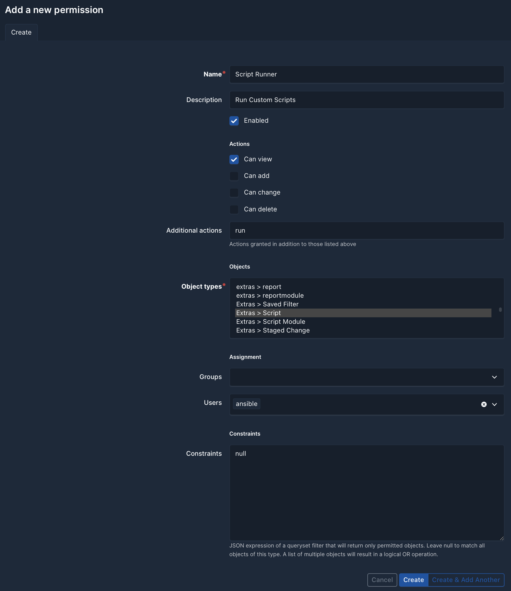
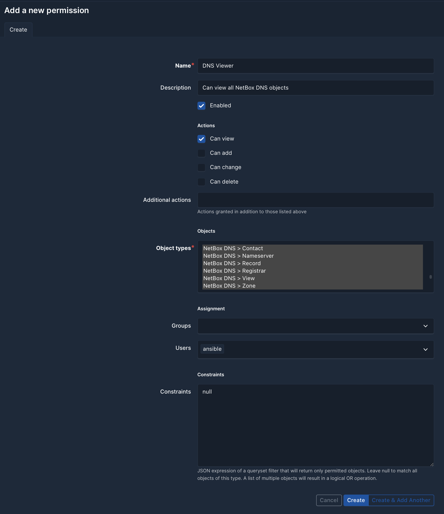
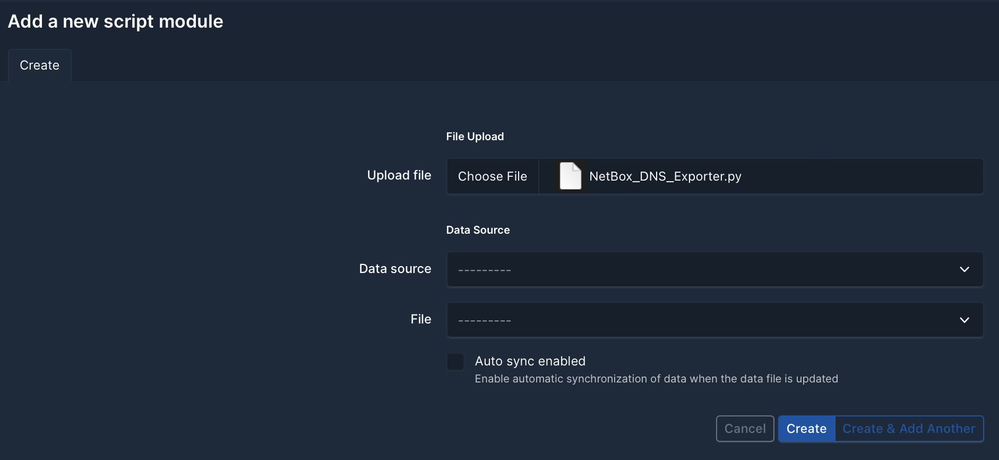
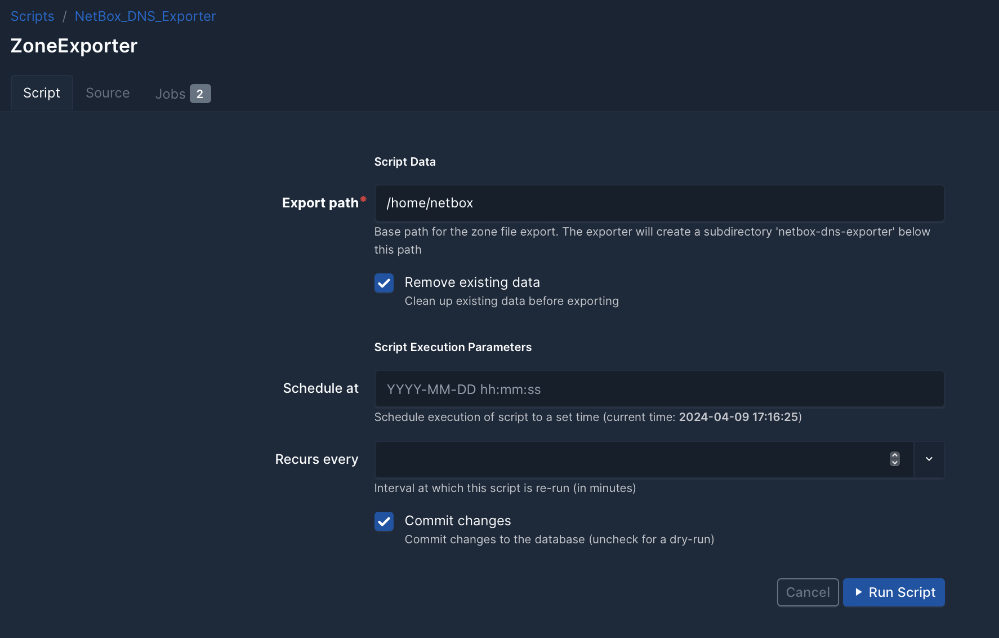
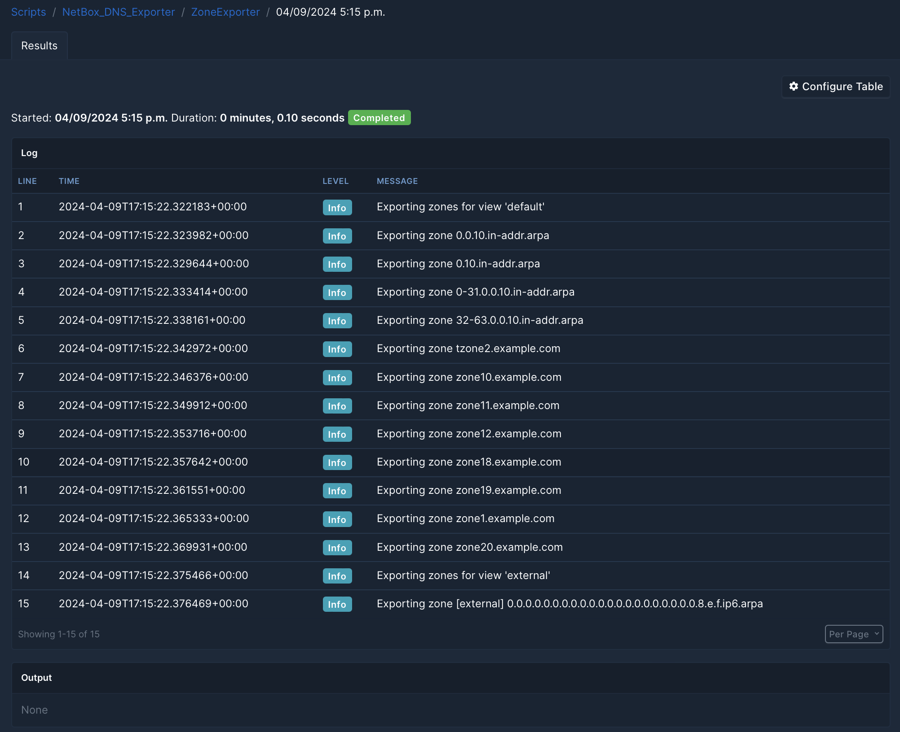

# Using Custom Scripts with NetBox DNS
There are some use cases in which it seems desirable to use the NetBox interface for operational procedures such as provisioning external instances like authoritative DNS servers with configuration data maintained in NetBox or NetBox modules.

While this is not the primary purpose of NetBox or, specifically, NetBox DNS, NetBox still provides means of providing that kind of functionality. For example, NetBox can trigger external tools using Webhooks, run automated reports on its data models, and can also provide so-called 'Custom Scripts' which are basically Python modules that operate on NetBox data.

## Exporting Zone Files from NetBox DNS
One request that was formulated in [NetBox DNS issue #8](https://github.com/peteeckel/netbox-plugin-dns/issues/8) concerns the export of zone data as zone files. This document describes the implementation of a custom script that can serve as a basis for own developments that perform this and similar actions.

### Preparing NetBox
Some configuration steps are necessary to enable the use of the exporter script.

#### Enabling the NetBox Custom Scripts Directory
By default custom scripts are not enabled in NetBox. To enable the functionality, it is necessary to uncomment the variable `SCRIPTS_ROOT` in the NetBox configuration file `configuration.py` and have it point to a directory where scripts reside.

```
SCRIPTS_ROOT = '/opt/netbox/netbox/scripts'
```
There is an empty file `__init__.py` located in the scripts directory, which is essential for the scripts functionality to work. Do not delete that file.

Finally, make the user NetBox is running under the owner of the scripts directory:

```
# chown -R netbox: /opt/netbox/netbox/scripts
```

NetBox needs to be restarted for these changes to become effective.

#### Granting Permissions to run Custom Scripts and view DNS data
A user that is supposed to run custom scripts needs the `extras.run_scripts` permission. This permission is not defined by default, so it must be created in the NetBox Administration interface:



This new permission grants the right to view custom scripts, and the additional action `run`. The assignment to the user that is to be used to run scripts (here 'ansible') can be done in the same step.

Additionally, a permission to view all DNS data is needed and must be created and assigned to the user to be allowed to run scripts in the same way:



#### Installing the Exporter Script
After these preparations, the example custom script `netbox_dns_exporters.py` can be installed using the NetBox GUI. Navigate to 'Customization/Scripts' in the sidebar, click on '+' and select the file containing the script for upload in the following dialog:



After clicking on 'Create' to install the script it can now be used to export zone data to the file system.

### Running the Exporter Script
To run the script, navigate to the 'Others' tab in the side bar and select the 'Scripts' menu entry.


The Script has the name 'Zone Exporter'. After selecting this entry from the menu, some parameters are requested before running it.



#### Export Path
The base path within the file system on the NetBox node where the export takes place. This directory needs to be writable for the NetBox user. By default, the NetBox home directory is used.

The exporter creates a sub-directory `netbox-dns-exporter` under the specified base path so that zone files can't accidentally overwrite existing files that happen to have the same name, and to make deleting existing exports less risky. Make sure that there is no subdirectory of this name that contains relevant data as they might get overwritten or deleted by the exporter.

#### Default view name
NetBox DNS supports views, but does not enforce their use. If a zone does not have a View associated with it, the view name in the export directory is set to the value in this field (`_default` by default).

#### Remove existing data
If selected, delete all data from the `netbox-dns-exporter` subdirectory before starting the export. This is a means to ensure that zone files for zones that have been deactivated or deleted are not lingering around from previous exports.

#### Commit changes
This is an option provided by the NetBox Custom Script mechanism. Since the exporter script does not change anything in the NetBox database, the setting is irrelevant.

#### Run Script
After the configuration options have been set or the default options accepted, the script can now be run using the 'Run Script' button.



After Execution, the exported zone data files should have been created in the selected diretory.

```
[netbox@example ~]$ tree netbox-dns-exporter/
netbox-dns-exporter/
├── default
│   ├── 0.0.10.in-addr.arpa.db
│   ├── 0.10.in-addr.arpa.db
│   ├── 0-31.0.0.10.in-addr.arpa.db
│   ├── 32-63.0.0.10.in-addr.arpa.db
│   ├── tzone2.example.com.db
│   ├── zone10.example.com.db
│   ├── zone11.example.com.db
│   ├── zone12.example.com.db
│   ├── zone18.example.com.db
│   ├── zone19.example.com.db
│   ├── zone1.example.com.db
│   └── zone20.example.com.db
└── external
    └── 0.0.0.0.0.0.0.0.0.0.0.0.0.0.0.0.0.0.0.0.0.8.e.f.ip6.arpa.db
```

### Caveats
This is a very simple exporter script that is meant to be a basis for users' own developments. It has not undergone extensive security auditing, is provided as-is and should not be used in production withou further scrutiny. You have neen warned.

### Further Considerations
Providing a functionality like the one of this script in the plugin itself is not currently being considered. Provisioning a DNS server is not in scope of the NetBox DNS plugin, which has been designed as a source of truth, not a management interface. This is in concordance with the NetBox project itself.

The way in which a plugin would interact with authoritative and slave DNS servers varies that much between platforms, implementations, server products and installations that it would mean an enormous effort to cater for all these variants.

On the other hand, there are many ways in which NetBox can be customised, so anyone with special requirements should be able to adapt it to their needs. One way of doing this has been outlined in this example.

See the discussion in [NetBox DNS issue #8](https://github.com/auroraresearchlab/netbox-dns/issues/8).
